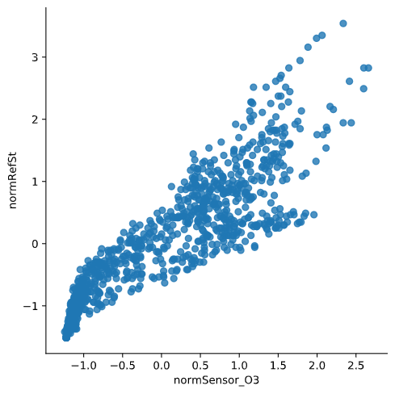
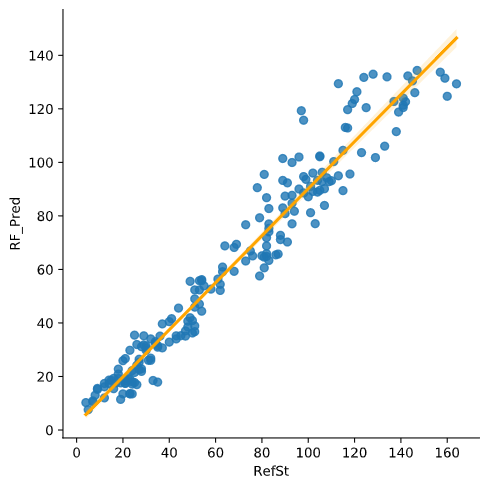

# Calibration of sensors in uncontrolled environments in Air Pollution Sensor Monitoring Networks

The objective of this project is to calibrate an air pollution sensor in an air pollution monitoring sensor network by using different methods based on *machine learning* and *deep learning*:
* Multiple linear regression (MLR)
* K-nearest neighbor (KNN)
* Random forest (RF)
* Kernel regression (RBF and polynomial)
* Gaussian Process (GP)
* Support Vector Regression (SVR)
* Neural Network (NN)

## About
**Author**  
Marcel Cases i Freixenet &lt;marcel.cases@estudiantat.upc.edu&gt;

**Course**  
Topics on Optimization and Machine Learning (TOML-MIRI)  
FIB - Universitat Politècnica de Catalunya. BarcelonaTech  
June 2021 

## Dataset

The dataset consists in the data collected by an air pollution sensor in an air pollution monitoring sensor network. It contains 1000 samples.

The data is organized as follows:
* date: Timestamp (UTC) for each measurement
* RefSt: Reference Station O3 concentrations, in μgr/m3 (real pollution levels)
* Sensor O3: MOX sensor measurements, in KΩ (unaccurated pollution levels to be calibrated)
* Temp: Temperature sensor, in °C
* RelHum: Relative humidity sensor, in %

## Data observation

Plot of **ozone** (KOhms) and **ozone reference data** (μgr/m3) as function of time:

Both datasets follow a similar pattern at a different scale factor, even though their units are different (KOhms vs. μgr/m3).

There is linear dependency between **ozone sensor data** and **ozone reference data**. The scatter plot below shows this dependency, with its corresponding dispersion due to lack of calibration:

These data can be **normalised** to standarize the information, which originally has different units:

As we see in the plot, normalisation does not modify the original data shape.

**Temp** with respect to **Sensor_O3**:

**Temp** with respect to **RefSt**:

**RelHum** with respect to **Sensor_O3**:

**RelHum** with respect to **RefSt**:

When comparing the plots with respect to **Sensor_O3** and with respect to **RefSt**, we see that the shape is similar but not the same, meaning that the data from the sensor is similar to the reference but not the same due to lack of calibration.

Furthermore, both variables **Temp** and **RelHum** show on the plots that there is a correlation between them and the reference data **RefSt**, meaning that the combination of **Temp**, **RelHum** and **Sensor_O3** is a good base for making predictions and obtain results similar to true measurements **RefSt**. 

## Data calibration

### Multiple Linear Regression

#### With normal equations

The most widely used equation to predict levels of ozone is a linear combination of the following independent variables:

Pred = β0 + β1·Sensor_O3 + β2·Temp + β3·RelHum

By using `sklearn`'s linear regression fit function, we obtain the values:

β0 = -34.03167  
β1 = 0.1592929  
β2 = 2.4969413  
β3 = -0.0294947  

The graph below compares the **concentration at the reference station** with the obtained **predicted values** after calibration with Multiple Linear Regression.

To compare the predicted data with the reference, we draw a scatterplot with a linear regression as follows:

To check performance and later compare them, some regression loss function values are calculated for each method: **R-square** R2, **Root-mean-square deviation** RMSE, and **Mean absolute error** MAE.

The obtained loss functions for Multiple Linear Regression are:
* R-squared = 0.8959208007572963
* RMSE = 182.97679748753583
* MAE = 10.592845738937898

The new scatterplot, when compared to the original (raw sensor data **Sensor_O3** vs. reference **RefSt**), shows a thinner concentration as it fits better to a line shape, although it is not totally linear yet.

#### With gradient descent method

##### Batch

##### Stochastic

##### Mini-batch

### K-Nearest Neighbor

K-Nearest Neighbor is considered to be a lazy learning algorithm because it doesn’t have a specialized training phase.

For a K-Nearest Neighbor regression, a value of *k* (number of neighbors) must be chosen. It is recommended to choose k = sqrt(n), as long as it fulfills:
* k value should be odd
* k value must not be multiples of the number of classes
* should not be too small or too large

Increasing *k* will tend to smooth graph boundaries and will avoiding overfitting at the cost of some resolution on the predicted output.

With these considerations, *k* is set to 31, and the results below are obtained:

The obtained loss functions for K-Nearest Neighbor with k=31 are:
* R-squared = 0.870218865614176
* RMSE = 228.1621737773153
* MAE = 10.640032258064515

### Random Forest

There is one hyperparameter to be set in Random Forest: number of trees (estimators). To tune this parameter for this problem, some performance stats are calculated: **R_squared**, **RMSE**, **MAE**, and **time to solve** (in ms). These parameters are plotted against the number of estimators **n_estimators**, which ranges from 1 to 100.

R2 vs. n_estimators:

RMSE vs. n_estimators:

MAE vs. n_estimators:

Time (ms) vs. n_estimators:

As showed in the plots, any value for **n_estimators** &ge; 30 tend to stabilize the performance. Given that the time grows linearly as n_estimators increases, we conclude that an optimal value for n_estimators is 30.

Hyperparameters setup:
* Number of trees (estimators) = 30

Obtained results:

The obtained loss functions for Random Forest with the hyperparameters specified above are:
* R-squared = 0.9928955668645113
* RMSE = 12.489973333333332
* MAE = 2.320866666666667

Variable importances:
* Sensor_O3: 0.8021535859094017
* Temp: 0.17748165305476926
* RelHum: 0.02036476103582912

### Kernel Regression

#### RBF kernel

#### Polynomial kernel

### Gaussian Process

### Support Vector Regression

### Neural Network

Nh = Ns/(α∗ (Ni + No))

Hyperparameters setup:
* Number of hidden layers Nh = 5
* Neurons per layer = 64
* Epochs = 200
* Batch size = 10

Training results:
* Training time: 49 seconds
* Minimum loss: 56.2758

Obtained results:

The obtained loss functions for Neural Network with the hyperparameters specified above are:
* R-squared = 0.9669973687497283
* RMSE = 58.02039042167329
* MAE = 5.296128118515015

## Source code

You can check out the source code used for modeling and solving the problems on the GitHub repo:  
[github.com/marcelcases/calibration-sensors-uncontrolled-environments](https://github.com/marcelcases/calibration-sensors-uncontrolled-environments)

## References
Task statement  
Barceló-Ordinas, Doudou, Garcia-Vidal, Badache. *Self-calibration methods for uncontrolled environments in sensor networks: A reference survey*  
Badura, Batog, Drzeniecka, Modzel. *Regression methods in the calibration of low‑cost sensors for ambient particulate matter measurements*  
Pandas documentation [pandas.pydata.org/docs/](https://pandas.pydata.org/docs/)  
