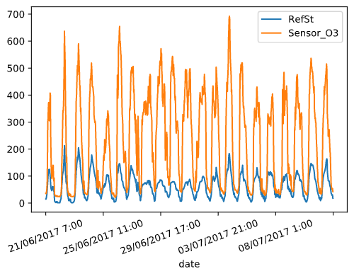
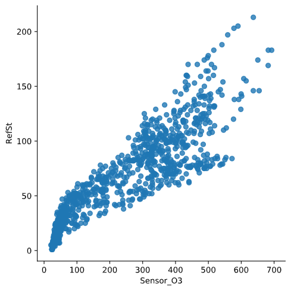

# Calibration of sensors in uncontrolled environments in Air Pollution Sensor Monitoring Networks

The objective of this project is to calibrate an air pollution sensor in an air pollution monitoring sensor network by using different methods based on *machine learning* and *deep learning*:
* Multiple linear regression (MLR)
* K-nearest neighbor (KNN)
* Random forest (RF)
* Kernel regression (RBF and polynomial)
* Gaussian Process (GP)
* Support Vector Regression (SVR)
* Neural Network (NN)

## About
**Author**  
Marcel Cases i Freixenet &lt;marcel.cases@estudiantat.upc.edu&gt;

**Course**  
Topics on Optimization and Machine Learning (TOML-MIRI)  
FIB - Universitat Politècnica de Catalunya. BarcelonaTech  
June 2021 

## Dataset

The dataset consists in the data collected by an air pollution sensor in an air pollution monitoring sensor network. It contains 1000 samples.

The data is organized as follows:
* date: Timestamp (UTC) for each measurement
* RefSt: Reference Station O3 concentrations, in μgr/m3 (real pollution levels)
* Sensor O3: MOX sensor measurements, in KΩ
* Temp: Temperature sensor, in °C
* RelHum: Relativa humidity sensor, in %

## Data observation

Plot of **ozone** (KOhms) and **ozone reference data** (μgr/m3) as function of time:

Both datasets follow a similar pattern at a different scale factor, even though their units are different (KOhms vs. μgr/m3).

There is linear dependency between **ozone sensor data** and **ozone reference data**. The scatter plot below shows this dependency, with its corresponding dispersion due to lack of calibration:

These data can be **normalised** to standarize the information, which originally has different units:

As we see in the plot, normalisation does not modify the original data shape.

**Temp** with respect to **Sensor_O3**:

**Temp** with respect to **RefSt**:

**RelHum** with respect to **Sensor_O3**:

**RelHum** with respect to **RefSt**:

When comparing the plots with respect to **Sensor_O3** and with respect to **RefSt**, we see that the shape is similar but not the same, meaning that the data from the sensor is similar to the reference but not the same due to lack of calibration.

## Data calibration

### Multiple Linear Regression

#### With normal equations

The most widely used equation to predict levels of ozone is a linear combination of the following independent variables:

Pred = β0 + β1·Sensor_O3 + β2·Temp + β3·RelHum

By using `sklearn`'s linear regression fit function, we obtain the values:

β0 = -34.03167  
β1 = 0.1592929  
β2 = 2.4969413  
β3 = -0.0294947  

The graph below compares the **concentration at the reference station** with the obtained **predicted values** after calibration with Multiple Linear Regression.

To compare the predicted data with the reference, we draw a scatterplot with a linear regression as follows:

To check performance and compare them later, some regression loss function values are calculated for each method: R-square R2, Root-mean-square deviation RMSE, and Mean absolute error MAE.

The obtained loss functions for Multiple Linear Regression are:
* R-squared = 0.8959208007572963
* RMSE = 182.97679748753583
* MAE = 10.592845738937898

The new scatterplot, when compared to the original (raw sensor data **Sensor_O3** vs. reference **RefSt**), shows a thinner concentration as it fits better to a line shape, although it is not totally linear yet.

#### With gradient descent method

##### Batch

##### Stochastic

##### Mini-batch

### K-nearest Neighbor

### Random Forest

### Kernel Regression

#### RBF kernel

#### Polynomial kernel

### Gaussian Process

### Support Vector Regression

### Neural Network

## Source code

You can check out the source code used for modeling and solving the problems on the GitHub repo:  
[github.com/marcelcases/calibration-sensors-uncontrolled-environments](https://github.com/marcelcases/calibration-sensors-uncontrolled-environments)

## References
Task statement  
Badura, Batog, Drzeniecka, Modzel. *Regression methods in the calibration of low‑cost sensors for ambient particulate matter measurements*  
Barceló-Ordinas, Doudou, Garcia-Vidal, Badache. *Self-calibration methods for uncontrolled environments in sensor networks: A reference survey*  
Pandas documentation [pandas.pydata.org/docs/](https://pandas.pydata.org/docs/)  
