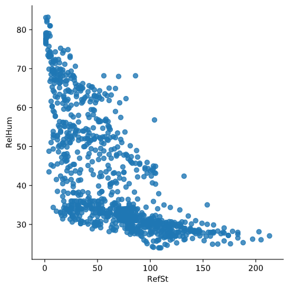

# Calibration of sensors in uncontrolled environments in Air Pollution Sensor Monitoring Networks

The objective of this project is to calibrate an air pollution sensor in an air pollution monitoring sensor network by using different methods based on *machine learning* and *deep learning*:
* Multiple linear regression (MLR)
* K-nearest neighbor (KNN)
* Random forest (RF)
* Kernel regression (RBF and polynomial)
* Gaussian Process (GP)
* Support Vector Regression (SVR)
* Neural Network (NN)

## About
**Author**  
Marcel Cases i Freixenet &lt;marcel.cases@estudiantat.upc.edu&gt;

**Course**  
Topics on Optimization and Machine Learning (TOML-MIRI)  
FIB - Universitat Politècnica de Catalunya. BarcelonaTech  
June 2021 

## Dataset

The dataset consists in the data collected by an air pollution sensor in an air pollution monitoring sensor network. It contains 1000 samples.

The data is organized as follows:
* date: Timestamp (UTC) for each measurement
* RefSt: Reference Station O3 concentrations, in μgr/m3
* Sensor O3: MOX sensor measurements, in KΩ
* Temp: Temperature sensor, in °C
* RelHum: Relativa humidity sensor, in %

## Data observation

Plot of **ozone** (KOhms) and **ozone reference data** (μgr/m3) as function of time:

Both datasets follow a similar pattern at a different scale factor, even though their units are different (KOhms vs. μgr/m3).

There is linear dependency between **ozone sensor data** and **ozone reference data**. The scatter plot below shows this dependency, with its corresponding dispersion due to lack of calibration:

These data can be **normalised** to standarize the information, which originally has different units:

As we see in the plot, normalisation does not modify the original data shape.

**Temp** with respect to **Sensor_O3**:

**Temp** with respect to **RefSt**:

**RelHum** with respect to **Sensor_O3**:

**RelHum** with respect to **RefSt**:

When comparing the plots with respect to **Sensor_O3** or with respect to **RefSt**, we see that the shape is similar but not the same, meaning that the data from the sensor is similar to the reference but not the same due to lack of calibration.

## Source code

You can check out the source code used for solving the problems on the GitHub repo:  
[github.com/marcelcases/calibration-sensors-uncontrolled-environments](https://github.com/marcelcases/calibration-sensors-uncontrolled-environments)

## References
Task statement  
Hanz Rodríguez Ramos. *The deployment of extra relay nodes around the sink in order to solve the energy imbalanced problem in Wireless Sensor Networks*  
M. Doudou, J. M. Barcelo-Ordinas, D. Djenouri, J. Garcia-Vidal, A. Bouabdallah, and N. Badache. *Game theory framework for mac parameter optimization in energy-delay constrained sensor networks*  
GPkit documentation [gpkit.readthedocs.io/en/latest/](https://gpkit.readthedocs.io/en/latest/)  
