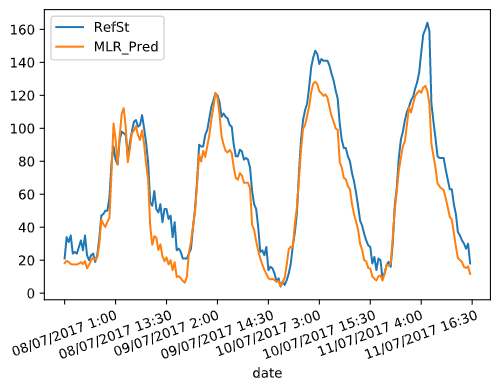
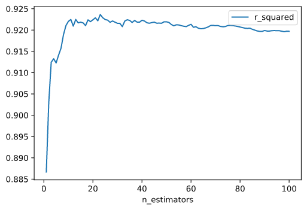
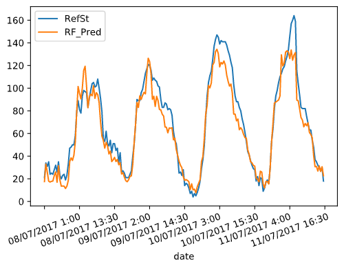
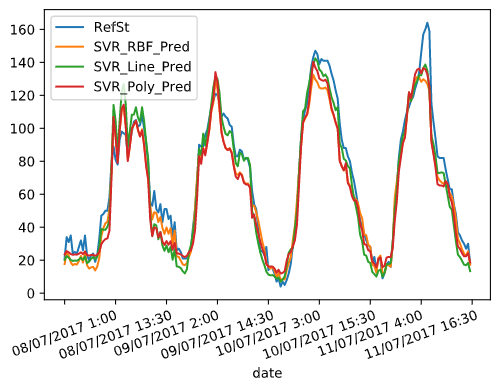

# Calibration of sensors in uncontrolled environments in Air Pollution Sensor Monitoring Networks

The objective of this project is to calibrate an air pollution sensor in an air pollution monitoring sensor network by using different methods based on **machine learning** and **deep learning**:
* Multiple Linear Regression (MLR)
* K-Nearest Neighbor (KNN)
* Random Forest (RF)
* Kernel Regression (KR)
* Gaussian Process (GP)
* Support Vector Regression (SVR)
* Neural Network (NN)

## About
**Author**  
Marcel Cases i Freixenet &lt;marcel.cases@estudiantat.upc.edu&gt;

**Course**  
Topics on Optimization and Machine Learning (TOML-MIRI)  
FIB - Universitat Politècnica de Catalunya. BarcelonaTech  
June 2021 

## Dataset

The dataset consists in the data collected by an air pollution sensor in an air pollution monitoring sensor network. It contains 1000 samples.

The data is organized as follows:
* *date*: Timestamp (UTC) for each measurement
* *RefSt*: Reference Station O3 concentrations, in μgr/m3 (real pollution levels)
* *Sensor_O3* : MOx sensor measurements, in KΩ (unaccurated pollution levels to be calibrated)
* *Temp*: Temperature sensor, in °C
* *RelHum*: Relative humidity sensor, in %

## Data observation

Plot of **ozone sensor** (*Sensor_O3*, KOhms) and **ozone reference data** (*RefSt*, μgr/m3) as function of time:

Both datasets follow a similar pattern at a different scale factor, even though their units are different (KOhms vs. μgr/m3).

There is linear dependency between **ozone sensor data** and **ozone reference data**. The scatter plot below shows this dependency, with its corresponding dispersion due to lack of calibration:

These data can be **normalised** to standarize the information, which originally has different units:

As we see in the plot, normalisation does not modify the original data shape.

*Temp* with respect to *Sensor_O3*:

*Temp* with respect to *RefSt*:

*RelHum* with respect to *Sensor_O3*:

*RelHum* with respect to *RefSt*:

When comparing the plots with respect to *Sensor_O3* and with respect to *RefSt*, we see that the shape is similar but not the same, meaning that the data from the sensor is similar to the reference but not the same due to lack of calibration.

Furthermore, both variables *Temp* and *RelHum* show on the plots that there is a correlation between them and the reference data *RefSt*, meaning that the combination of *Temp*, *RelHum* and *Sensor_O3* is a good base for making predictions and obtain results similar to true measurements *RefSt*. 

## Data calibration

A data calibration process must be performed. To do that, data captured by the network of three sensors (*Sensor_O3*, *Temp*, and *RelHum*, the **explanatory variables**) will be trained against reference data *RefSt* (the **response variable**) using different regression algorithms.

For this purpose, the main dataset is splitted into two datasets (train and test), with **proportions 80%-20%**. Train dataset has 800 rows of information, while test dataset has 200 rows. Given that the dataset contains data from 21 consecutive days, we assume that the **data does not have seasonality**. This is why data split is made without shuffling.

The algorithms are trained using the train dataset (which contains data from the first 17 days), and the results (predictions, loss functions and plots) are calculated using the test dataset (which has data from the last 4 days).

To check performance and later compare them, some **regression loss function** values are calculated for each method:
* *Coefficient of determination* R2: determines to what extent the variance of one variable explains the variance of the second variable
* *Root-mean-square error* RMSE:  the standard deviation of the residuals (prediction errors)
* *Mean absolute error* MAE: a measure of errors between paired observations expressing the same phenomenon

### Multiple Linear Regression

#### With normal equations

The most widely used equation to predict levels of ozone is a linear combination of the following independent variables:

Pred = β0 + β1·Sensor_O3 + β2·Temp + β3·RelHum

By using `sklearn`'s linear regression fit function, we obtain the values:
* β0 = -41.76274629511223  
* β1 = 0.15859004  
* β2 = 2.61759675  
* β3 = 0.05330829  

The graph below compares the **real concentration levels at the reference station** (*RefSt*) with the obtained **predicted values** (*MLR_Pred*) after calibration with Multiple Linear Regression.

To compare the predicted data with the reference, we draw a scatterplot with a linear regression as follows:

The obtained loss functions for Multiple Linear Regression are:
* R2 = 0.8732519296681992
* RMSE = 216.09227494770417
* MAE = 12.256238765981713

The new scatterplot, when compared to the original (raw sensor data *Sensor_O3* vs. reference *RefSt*), shows a thinner concentration as it fits better to a line shape, although it is not totally linear.

#### With Stochastic Gradient Descent

 Stochastic Gradient Descent is well suited for regression problems with a large number of training samples (>10.000), authough it is suitable for smaller sets.

The data has to be normalised to run a SGD algorithm.

The values obtained by the fit function are:
* β0 = 63.5838835  
* β1 = 26.38886151  
* β2 = 16.75646248  
* β3 = -1.34007258  

MLR with SGD prediction:

MLR with SGD correlation:

The obtained loss functions for Multiple Linear Regression with Stochastic Gradient Descent are:
* R2 = 0.9200425392993397
* RMSE = 136.3191529197765
* MAE = 9.344936428513078

### K-Nearest Neighbor

K-Nearest Neighbor takes the k-nearest data points and averages them to create a regression (or classification, for other applications). Choosing the right *k* (number of neighbors) is key to find the best approximation.

For a KNN regression, the hyperparameter to be set is the **number of neighbors** (*k*). To tune this parameter, some performance stats are calculated: **R2**, **RMSE**, **MAE**, and **time to solve** (in ms). These parameters are plotted against the number of estimators *k*, which ranges from 1 to 150.

R2 vs. number of neighbors *k*:

RMSE vs. number of neighbors *k*:

MAE vs. number of neighbors *k*:

Time (ms) vs. number of neighbors *k*:

As showed in the plots, a value of *k* around 20 will optimize the performance, as the loss will be minimal.

There are also some guidelines to choose the optimal value of *k*. It is recommended to choose *k ≈ sqrt(n)*, being *n* the size of the train dataset. The following rules should be fulfilled:
* *k* value should be odd
* *k* value must not be multiples of the number of classes
* should not be too small or too large

Increasing *k* too much will tend to smooth graph boundaries and will avoiding overfitting at the cost of some resolution on the predicted output.

The computing time is not a constraint, as increasing the number of neighbors does not increase the execution time (it remains constant to 2ms or 3ms for any value of *k*).

With these considerations and the results of the optimization, *k* is set to 19 neighbors, and the results below are obtained:

The obtained loss functions for K-Nearest Neighbor with ``k = 19`` are:
* R2 = 0.9258139236698661
* RMSE = 126.47954293628808
* MAE = 8.27657894736842

### Random Forest

Random Forest is an ensemble method for regression that combines the predictions from multiple machine learning algorithms. It returns the mean or average prediction of the individual trees to make predictions. The trees in random forests run in parallel, having no interaction among trees when building them.

There is one hyperparameter to be set in Random Forest: **number of trees** (*n_estimators*). To tune this parameter for this problem, some performance stats are calculated: **R2**, **RMSE**, **MAE**, and **time to solve** (in ms). These parameters are plotted against the number of estimators *n_estimators*, which ranges from 1 to 100.

R2 vs. *n_estimators*:

RMSE vs. *n_estimators*:

MAE vs. *n_estimators*:

Time (ms) vs. *n_estimators*:

As showed in the plots, any value for *n_estimators* &ge; 20 tend to stabilize the performance. Given that the time grows linearly as *n_estimators* increases, it can be concluded that an optimal value for **number of trees** (*n_estimators*) is 20.

Obtained results:

The obtained loss functions for Random Forest with the hyperparameters specified above are:
* R2 = 0.922410493402684
* RMSE = 132.2820375
* MAE = 8.93075

Variable importances:
* *Sensor_O3*: 78.9%
* *Temp*: 19.1%
* *RelHum*: 2%

### Kernel Regression

Two kernel regression methods are tested:
* Radial basis function kernel (RBF)
* Polynomial kernel

Polynomial kernel has one hyperparameter, which is the **polynomial degree**. To choose the degree, some performance tests are made for a range of degree from 1 to 25:

R2 vs. polynomial degree:

RMSE vs. polynomial degree:

MAE vs. polynomial degree:

Time (ms) vs. polynomial degree:

The polynomial degree is set to 4, and the results below are obtained:

RBF kernel vs. *RefSt*:

Polynomial kernel vs. *RefSt*:

The obtained loss functions for RBF and Polynomial Kernel Regression with the hyperparameters specified above are:

| Kernel |    R2   |        RMSE        | MAE               |
|:------:|:------------------:|:------------------:|-------------------|
|   RBF  | **0.9180037342579421** | **139.79510342866496** | **9.241265994040084** |
|  Polynomial  | 0.9055215854097209 | 161.07586875934803 | 9.56037412633461  |

RBF kernel has a slightly better performance when compared to polynomial kernel.

### Gaussian Process

Gaussian Process regression is used with two kernels:
* RBF
* Dot product (linear)

Alpha is a value added to the diagonal of the kernel matrix during fitting, ensuring that the calculated values form a positive definite matrix. A value of `alpha = 150` gives a good performance at an acceptable computing time to both methods, especially to RBF, with the results below:

RBF kernel vs. *RefSt*:

Dot product kernel vs. *RefSt*:

The obtained loss functions for Gaussian Process with RBF kernel and dot product, and with the hyperparameters specified above are:

| Kernel |    R2   |        RMSE       | MAE               |
|:------:|:------------------:|:-----------------:|-------------------|
|   RBF  | **0.9275242503753743** | **123.5636138201321** | **8.567122982155226** |
|   Dot  |  0.914179681530673 | 146.3147155315738 | 9.706846921532744 |

RBF outperforms dot product kernel.

### Support Vector Regression

Support Vector Regression is used with three kernels:
* RBF
* Linear
* Polynomial, degree 3

Results:

SVR with RBF kernel vs. *RefSt*:

SVR with linear kernel vs. *RefSt*:

SVR with polynomial kernel vs. *RefSt*:

Performance results:

|   Kernel   |    R2   |        RMSE        | MAE                |
|:----------:|:------------------:|:------------------:|--------------------|
|     RBF    | 0.9356650868795593 |  109.68433443101408 | 8.085332236192567  |
|   Linear   | **0.9397667230676832** |  **102.69147140296738** | **7.938243017342343**   |
| Polynomial | 0.9267388675016871 | 124.90260992031536 | 9.03009598862447 |

### Neural Network

The Neural Network model is developed using `tensorflow`'s libraries. There are some hyperparameters to tune: *number of hidden layers*, *neurons per layer*, *epochs* (number of complete passes through the training dataset) and *batch size* (number of training samples to work through before the model's internal parameters are updated).

For the number of hidden layers, the recommended relation is:

Nh = Ns/(α∗ (Ni + No))

Where:
* Nh is number of hidden layers
* Ns is size of the dataset
* Ni is number of input neurons
* No is number of output neurons
* α is an arbitrary scaling factor (from 2 to 10)

With these guidelines, the number of hidden layers is set to 5 and the number of neurons per layer is set to 64.

Regarding the number of epochs, after approximately 750 epochs the loss is stabilized:

Thus the number of epochs is set to 750.

Some tests were made with the batch size, and a value of 10 turns out to be the one that provides better results.

Hyperparameters setup summary:
* Number of hidden layers Nh = 5
* Neurons per layer = 64
* Epochs = 750
* Batch size = 10

The activation function that has been used is `ReLU`, as it it makes the model easy to train and achieves a good performance.

The optimizer that has been used is `adam`, a stochastic gradient descent method that is able to handle sparse gradients on noisy problems, like the case of data gathered form sensors.

The training process has to be done with normalised values of the data.

Training results:
* Training time: 2m 15s
* Minimized loss: 19.664

Obtained results:

The obtained loss functions for Neural Network with the hyperparameters specified above are:
* R2 = 0.9402881574652502
* RMSE = 101.80247999732873
* MAE = 8.050368747711182

## Results summary

The table below shows the performance results of each method obtained in the calibration process:

|                          Method                          | R2 |      RMSE      |      MAE     |
|:--------------------------------------------------------:|:-------------:|:--------------:|:------------:|
|           Multiple Linear Regression (equation)          |    0.873251   |   216.092274   |   12.256238  |
| Multiple Linear Regression (Stochastic Gradient Descent) |    0.920042   |   136.319152   |   9.344936   |
|                    K-Nearest Neighbor                    |    0.925813   |   126.479542   |   8.276578   |
|                       Random Forest                      |    0.922410   |   132.282037   |   8.930750   |
|          Radial Basis Function Kernel Regression         |    0.918003   |   139.795103   |   9.241265   |
|           Polynomial Function Kernel Regression          |    0.905521   |   161.075868   |   9.560374   |
|          Radial Basis Function Gaussian Process          |    0.927524   |   123.563613   |   8.567122   |
|           Dot Product Function Gaussian Process          |    0.914179   |   146.314715   |   9.706846   |
|      Radial Basis Function Support Vector Regression     |    0.935665   |   109.684334   |   8.085332   |
|             Linear Support Vector Regression             |    0.939766   |   102.691471   | **7.938243** |
|           Polynomial Support Vector Regression           |    0.926738   |   124.902609   |   9.030095   |
|                      Neural Network                      |  **0.940288** | **101.802479** |   8.050368   |

Regarding the results, the top three regression methods according to their prediction performance are:

| Ranking |                    Method                    |    R2    |    RMSE    |    MAE   |
|:-------:|:--------------------------------------------:|:--------:|:----------:|:--------:|
|  Top 1  |                Neural Network                | **0.940288** | **101.802479** | 8.050368 |
|  Top 2  | Support Vector Regression with linear kernel | 0.939766 | 102.691471 | **7.938243** |
|  Top 3  |   Support Vector Regression with RBF kernel  | 0.935665 | 109.684334 | 8.085332 |

### Conclusion

The Neural Network seems to provide a slightly better performance when compared to Support Vector Regression, but given that the stats are so similar, for this particular problem I would choose SVR with linear kernel, as the process is more deterministic than a NN. That is, in SVR, the performance results are always the same for each run (same R2, RMSE and MAE), but in the NN, these stats may change for each run because part of the optimization process is randomized. Furthermore, SVR fit process is faster than the equivalent process in a NN.

## Source code

You can check out the source code used for modeling and solving the problems, as well as plotting all graphs, on the GitHub repo:  
[github.com/marcelcases/calibration-sensors-uncontrolled-environments](https://github.com/marcelcases/calibration-sensors-uncontrolled-environments)

## References
Task statement  
Barceló-Ordinas, Doudou, Garcia-Vidal, Badache. *Self-calibration methods for uncontrolled environments in sensor networks: A reference survey*  
Badura, Batog, Drzeniecka, Modzel. *Regression methods in the calibration of low‑cost sensors for ambient particulate matter measurements*  
Pandas documentation [pandas.pydata.org/docs/](https://pandas.pydata.org/docs/)  
Sklearn documentation [scikit-learn.org/stable/modules/classes.html](https://scikit-learn.org/stable/modules/classes.html)  
Tensorflow documentation [tensorflow.org/api_docs/python/tf](https://www.tensorflow.org/api_docs/python/tf)  
