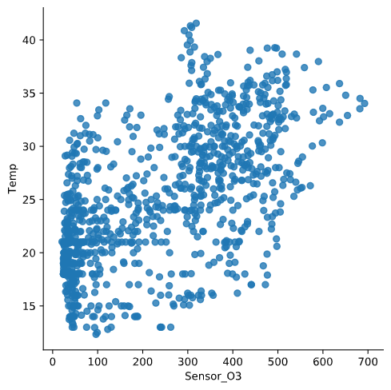
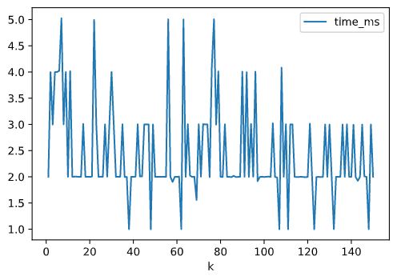
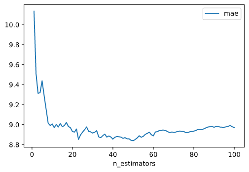
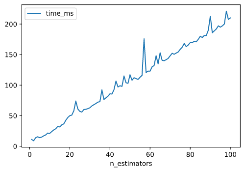

# Calibration of sensors in uncontrolled environments in Air Pollution Sensor Monitoring Networks

The objective of this project is to calibrate an air pollution sensor in an air pollution monitoring sensor network by using different methods based on *machine learning* and *deep learning*:
* Multiple linear regression (MLR)
* K-nearest neighbor (KNN)
* Random forest (RF)
* Kernel regression (RBF and polynomial)
* Gaussian Process (GP)
* Support Vector Regression (SVR)
* Neural Network (NN)

## About
**Author**  
Marcel Cases i Freixenet &lt;marcel.cases@estudiantat.upc.edu&gt;

**Course**  
Topics on Optimization and Machine Learning (TOML-MIRI)  
FIB - Universitat Politècnica de Catalunya. BarcelonaTech  
June 2021 

## Dataset

The dataset consists in the data collected by an air pollution sensor in an air pollution monitoring sensor network. It contains 1000 samples.

The data is organized as follows:
* date: Timestamp (UTC) for each measurement
* RefSt: Reference Station O3 concentrations, in μgr/m3 (real pollution levels)
* Sensor O3: MOX sensor measurements, in KΩ (unaccurated pollution levels to be calibrated)
* Temp: Temperature sensor, in °C
* RelHum: Relative humidity sensor, in %

## Data observation

Plot of **ozone** (KOhms) and **ozone reference data** (μgr/m3) as function of time:

Both datasets follow a similar pattern at a different scale factor, even though their units are different (KOhms vs. μgr/m3).

There is linear dependency between **ozone sensor data** and **ozone reference data**. The scatter plot below shows this dependency, with its corresponding dispersion due to lack of calibration:

These data can be **normalised** to standarize the information, which originally has different units:

As we see in the plot, normalisation does not modify the original data shape.

**Temp** with respect to **Sensor_O3**:

**Temp** with respect to **RefSt**:

**RelHum** with respect to **Sensor_O3**:

**RelHum** with respect to **RefSt**:

When comparing the plots with respect to **Sensor_O3** and with respect to **RefSt**, we see that the shape is similar but not the same, meaning that the data from the sensor is similar to the reference but not the same due to lack of calibration.

Furthermore, both variables **Temp** and **RelHum** show on the plots that there is a correlation between them and the reference data **RefSt**, meaning that the combination of **Temp**, **RelHum** and **Sensor_O3** is a good base for making predictions and obtain results similar to true measurements **RefSt**. 

## Data calibration

A data calibration process must be carried out. To do that, the data captured by the network of three sensors (*Sensor_O3*, *Temp*, and *RelHum*, the **explanatory variables**) will be trained against reference data *RefSt* (the **response variable)** using different regression algorithms.

For this purpose, the main dataset is splitted into two datasets (train and test), with proportions 80%/20%. Train dataset has 800 rows of information, while test dataset has 200 rows.

The algorithms are trained using the train dataset (which contains data from the first 17 days), and the results (predictions, loss functions and plots) are calculated using the test dataset (which has data from the last 4 days).

To check performance and later compare them, some regression loss function values are calculated for each method: **R-square** R2, **Root-mean-square deviation** RMSE, and **Mean absolute error** MAE.

### Multiple Linear Regression

#### With normal equations

The most widely used equation to predict levels of ozone is a linear combination of the following independent variables:

Pred = β0 + β1·Sensor_O3 + β2·Temp + β3·RelHum

By using `sklearn`'s linear regression fit function, we obtain the values:

β0 = -41.76274629511223  
β1 = 0.15859004  
β2 = 2.61759675  
β3 = 0.05330829  

The graph below compares the **concentration at the reference station** with the obtained **predicted values** after calibration with Multiple Linear Regression.

To compare the predicted data with the reference, we draw a scatterplot with a linear regression as follows:

The obtained loss functions for Multiple Linear Regression are:
* R-squared = 0.8732519296681992
* RMSE = 216.09227494770417
* MAE = 12.256238765981713

The new scatterplot, when compared to the original (raw sensor data **Sensor_O3** vs. reference **RefSt**), shows a thinner concentration as it fits better to a line shape, although it is not totally linear yet.

#### With gradient descent method

##### Batch

##### Stochastic

##### Mini-batch

### K-Nearest Neighbor

For a K-Nearest Neighbor regression, there is one hyperparameter to be set: number of neighbors (**n_neighbors**). To tune this parameter for this problem, some performance stats are calculated: **R_squared**, **RMSE**, **MAE**, and **time to solve** (in ms). These parameters are plotted against the number of estimators **n_neighbors**, which ranges from 1 to 150.

R2 vs. n_neighbors:

RMSE vs. n_neighbors:

MAE vs. n_neighbors:

Time (ms) vs. n_neighbors:

As showed in the plots, a value of *k* around 20 will optimize the performance, as the loss will be minimal.

To choose the optimal value of *k* (number of neighbors), some guidelines have been set. It is recommended to choose k = sqrt(n), as long as it fulfills:
* k value should be odd
* k value must not be multiples of the number of classes
* should not be too small or too large

Increasing *k* too much will tend to smooth graph boundaries and will avoiding overfitting at the cost of some resolution on the predicted output.

The computing time is not a constraint, as increasing the number of neighbors does not increase the execution time (it remains constant).

With these considerations and the results of the optimization, *k* is set to 19, and the results below are obtained:

The obtained loss functions for K-Nearest Neighbor with ``k=19`` are:
* R-squared = 0.9258139236698661
* RMSE = 126.47954293628808
* MAE = 8.27657894736842

### Random Forest

There is one hyperparameter to be set in Random Forest: number of trees (**n_estimators**). To tune this parameter for this problem, some performance stats are calculated: **R_squared**, **RMSE**, **MAE**, and **time to solve** (in ms). These parameters are plotted against the number of estimators **n_estimators**, which ranges from 1 to 100.

R2 vs. n_estimators:

RMSE vs. n_estimators:

MAE vs. n_estimators:

Time (ms) vs. n_estimators:

As showed in the plots, any value for **n_estimators** &ge; 20 tend to stabilize the performance. Given that the time grows linearly as n_estimators increases, we conclude that an optimal value for n_estimators is 20.

Hyperparameters setup:
* Number of trees (estimators) = 20

Obtained results:

The obtained loss functions for Random Forest with the hyperparameters specified above are:
* R-squared = 0.922410493402684
* RMSE = 132.2820375
* MAE = 8.93075

Variable importances:
* Sensor_O3: 0.7884045574615424
* Temp: 0.19142880544508606
* RelHum: 0.020166637093371624

### Kernel Regression

#### RBF kernel

#### Polynomial kernel

### Gaussian Process

### Support Vector Regression

### Neural Network

The Neural Network model is developed using `tensorflow`'s libraries. There are some hyperparameters to tune: *number of hidden layers*, *neurons per layer*, *epochs* (number of complete passes through the training dataset) and *batch size* (number of training samples to work through before the model's internal parameters are updated).

For the number of hidden layers, the recommended relation is:

Nh = Ns/(α∗ (Ni + No))

Where:
* Nh is number of hidden layers
* Ns is size of the dataset
* Ni is number of input neurons
* No is number of output neurons

With these guidelines, the number of hidden layers is set to 5 and the number of neurons per layer is set to 64.

Regarding the number of epochs, after approximately 150 epochs the loss is stabilized, so it is set to 200.

Some tests were made with the batch size, and a value of 10 turns out to be the one that provides better results.

Hyperparameters setup summary:
* Number of hidden layers Nh = 5
* Neurons per layer = 64
* Epochs = 200
* Batch size = 10

Training results:
* Training time: 49 seconds
* Minimized loss: 39.6488

Obtained results:

The obtained loss functions for Neural Network with the hyperparameters specified above are:
* R-squared = 0.9402881574652502
* RMSE = 101.80247999732873
* MAE = 8.050368747711182

## Source code

You can check out the source code used for modeling and solving the problems on the GitHub repo:  
[github.com/marcelcases/calibration-sensors-uncontrolled-environments](https://github.com/marcelcases/calibration-sensors-uncontrolled-environments)

## References
Task statement  
Barceló-Ordinas, Doudou, Garcia-Vidal, Badache. *Self-calibration methods for uncontrolled environments in sensor networks: A reference survey*  
Badura, Batog, Drzeniecka, Modzel. *Regression methods in the calibration of low‑cost sensors for ambient particulate matter measurements*  
Pandas documentation [pandas.pydata.org/docs/](https://pandas.pydata.org/docs/)  
